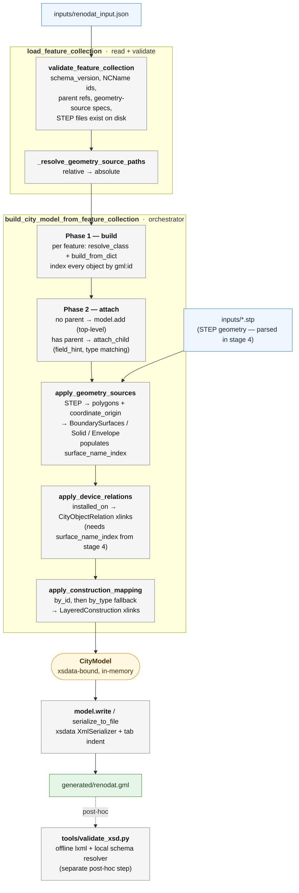

# CityGML 2.0 + Energy ADE 3.0 Creator

A Python toolkit for generating standards-compliant CityGML 2.0 files extended
with the Energy ADE 3.0 (beta8) application domain extension. The project
reads a single flat-dict JSON input, attaches imported STEP geometry, and
emits a fully XSD-validated GML file — without any hand-written XML.

This document describes the input format, the pipeline, the role of each
module, and the architectural decisions behind the codebase.

> **Viewing the output in KIT FZKViewer?** The viewer ships with an
> incompatible Energy ADE 2.0 schema and will silently mangle the file.
> See [§9 KIT ModelViewer compatibility](#9-kit-modelviewer-compatibility)
> for the one-time XSD swap.

---

## 1. What this project does

The goal is to produce a CityGML + Energy ADE GML file describing a
real-world building, its geometry, devices (PV panels, heat pumps, EV
chargers), occupants, thermal zones, schedules, and material/construction
libraries — from a single curated JSON dataset plus Rhino-exported STEP
geometry.

The reference dataset is **RenoDAT**, a single-family residence in Delft
modeled at LOD 0–3 with thermal zone parts. The same pipeline generalizes
to any building data that fits the supported feature catalog.

The output is a `.gml` file that:

- Validates against the official Energy ADE 3.0 beta8 XSD,
- Validates against the CityGML 2.0 + GML 3.1.1 XSD set,
- Renders correctly in the KIT FZKViewer (after the §9 XSD swap),
- Carries real-world coordinates in EPSG:28992 (RD) + EPSG:5109 (NAP).

---

## 2. Quick start

```powershell
# one-time setup
python -m venv .venv
.\.venv\Scripts\Activate.ps1
python -m pip install --upgrade pip
python -m pip install -e ".[dev]"

# generate the GML file
python examples/create_renodat.py

# validate it against the bundled XSDs (offline)
python tools/validate_xsd.py generated/renodat.gml

# run the test suite
python -m pytest -q
```

Custom paths:

```powershell
python examples/create_renodat.py --input inputs/renodat_input.json --output generated/renodat.gml
```

Requirements: Python 3.12+ and `lxml >= 5.0`. Dev extras add `pytest`,
`ruff`, `xsdata[cli,lxml]`, and `lxml-stubs`. For the city-scale
workflow (§12), the `city` extras add `requests`, `shapely`,
`python-dotenv`, and `flatgeobuf`. All declared in [pyproject.toml](pyproject.toml).

Two parallel input pipelines live in this repo:

| Workflow | Input format | What it does |
|---|---|---|
| **Per-building** (RenoDAT) | `schema_version: 2` JSON + Rhino STEP files | Hand-curated detailed Energy-ADE dataset per building (zones, schedules, devices, layered constructions). See §3–§9. |
| **City-scale** | `schema_version: "city-1"` JSON | Downloads BAG + 3DBAG + EP-online for a whole Dutch municipality and assembles one GML file. See §12. |

---

## 3. The input file

Everything the generator needs lives in a single JSON document
([inputs/renodat_input.json](inputs/renodat_input.json)). It has six
top-level keys (plus an optional `$schema`):

```jsonc
{
  "schema_version": 2,
  "city_model":          { "name": "...", "description": "..." },
  "coordinate_origin":   [85182.085, 446868.675, 0.105],
  "construction_mapping": {
    "by_type": { "WallSurface": "constr_external_wall",  "Window": "constr_window_hr" },
    "by_id":   { "id_building_1_Door2_1": "constr_front_door" }
  },
  "geometry_sources": [
    { "type": "step-renodat-lod3",
      "path": "Owner-Occupier1_LOD3_STEP.stp",
      "target_building_id": "id_building_1",
      "target_pv_id": "pv_panel_1" },
    { "type": "step-zonepart-lod3",
      "path": "Owner-Occupier1_ZonePart1_STEP.stp",
      "target_zone_part_id": "zone_part_1" }
  ],
  "features": [
    { "type": "bldg:Building",
      "id":   "id_building_1",
      "name": ["Han Solo's House"],
      "year_of_construction": "2020",
      "...": "..." },

    { "type":   "nrg3:PhotovoltaicCollector",
      "parent": "id_building_1",
      "id":     "pv_panel_1",
      "installed_power": { "value": 9720, "uom": "W" },
      "...": "..." }
  ]
}
```

Field-by-field semantics:

- **`schema_version`** *(required)* — must be `2`. The loader rejects any
  other value.
- **`city_model`** *(required)* — `{ "name": ..., "description": ... }`,
  both optional strings.
- **`features`** *(required)* — every CityGML/Energy ADE object, flat.
  Each has a `type` (`prefix:ElementName` resolved against the xsdata
  bindings), an `id`, an optional `parent` (parent's gml:id), and an
  optional `parent_field` to disambiguate the attachment point on the
  parent.
- **`coordinate_origin`** *(optional, defaults to `[0, 0, 0]`)* — XYZ
  vector added to every imported STEP point. Geometry is authored in a
  local Rhino frame; this offset places it on the correct RD/NAP
  coordinates.
- **`geometry_sources`** *(optional)* — list of STEP imports. The `type`
  selects the importer mode (see [§6.4](#64-citygml_energygeometry));
  each entry targets a specific feature by gml:id. Two target fields are
  recognized:
  - `step-renodat-lod{0..4}` sources require **`target_building_id`** and
    accept an optional **`target_pv_id`** (used by LOD 3 to attach
    `SolarPanelSurface_*` faces to a `PhotovoltaicCollector`).
  - `step-zonepart-lod{0..3}` sources require **`target_zone_part_id`** —
    the gml:id of an `nrg3:ZonePart` feature whose boundary surfaces
    will be populated from the STEP file.

  Geometry-source paths may be relative (resolved against the JSON's
  parent directory) or absolute, and must point to a file that exists
  at validation time.
- **`construction_mapping`** *(optional)* — two sub-dicts. `by_type`
  maps a surface/opening class name (`WallSurface`, `Window`, …) to a
  construction `gml:id`; `by_id` maps a specific surface `gml:id` to a
  construction. **`by_id` wins** for any surface it covers; `by_type`
  is the fallback. Both emit `xlink:href`s pointing into the in-document
  `LayeredConstructionLibrary`.
- **`$schema`** *(optional)* — pointer to
  [schemas/citygml_energy_input.schema.json](schemas/citygml_energy_input.schema.json)
  for VS Code autocomplete and inline validation while editing. The
  canonical [inputs/renodat_input.json](inputs/renodat_input.json) does
  not currently set it; add it manually if you want editor assistance.

---
## 4. Pipeline overview

The diagram below reflects the actual call tree — see
[citygml_energy/generation.py](citygml_energy/generation.py) and
[citygml_energy/input_loader.py](citygml_energy/input_loader.py) for
the source.



Every stage runs offline. No FME, no schema downloads, no XML templates.

### 4.1 Stage-by-stage breakdown

Each node in the diagram corresponds to a single function; here is
what each one does and why it lives where it does.

1. **`load_feature_collection(path)`** —
   [input_loader.py:68](citygml_energy/input_loader.py#L68). Reads the
   JSON (UTF-8 with BOM tolerated), runs `validate_feature_collection`,
   and normalizes every `geometry_sources[*].path` against the JSON's
   parent directory. Returns a cleaned, absolute-path dict.

2. **`validate_feature_collection(data)`** —
   [input_loader.py:94](citygml_energy/input_loader.py#L94). Rejects
   unknown top-level keys, asserts `schema_version == 2`, checks every
   feature has a valid XML NCName `id` and a `type` that
   `resolve_class` can locate, verifies every `parent` points to a
   known id, and for each `geometry_sources[*]` consults
   `GEOMETRY_SOURCE_SPECS` to validate required/optional target
   fields, the expected XSD type per target, and that the referenced
   STEP file exists on disk. The loader and the applier share the same
   spec registry, so they can never drift.

3. **`build_city_model_from_feature_collection(data)`** —
   [input_loader.py:192](citygml_energy/input_loader.py#L192). The
   orchestrator. Creates an empty `CityModel(gml_name, gml_description)`
   and runs a **two-phase build**:

   - **Phase 1 — build objects.** For every feature, calls
     `resolve_class("prefix:Local")` to map the type string to an
     xsdata class, then `build_from_dict(cls, attrs)` to build the
     object (nested dataclasses, code values, and xsdata
     date/time/duration/period types are coerced from plain JSON by
     `mapping._coerce`). Every built object is indexed by its `gml:id`,
     and any `installed_on: [...]` hints are collected for stage 5.
   - **Phase 2 — attach.** Each built object is either appended to
     `cityObjectMember` (no `parent`) via `CityModel.add`, or passed to
     `attach_child(parent_obj, child, field_hint=parent_field)`, which
     finds the right field on the parent by matching the child's
     runtime type against the parent's field types and property-type
     wrappers. The two-phase split is required because a parent may
     appear *after* its child in the flat `features` list.

4. **`apply_geometry_sources(model, sources, origin, srs)`** —
   [geometry.py:324](citygml_energy/geometry.py#L324). For each STEP
   source: parses the file via `_step.parse_named_shells` (LoD 3 with
   layer names like `WallSurface_04`, `Window_05`,
   `SolarPanelSurface_*|parent=RoofSurface_02`) or
   `_step.parse_all_polygons` (anonymous solids for LoD 1/2 and zone
   parts), adds `coordinate_origin` to every coordinate, builds
   `gml:Polygon` / `gml:MultiSurface` / `gml:Solid` / `gml:Envelope`
   via `_gml_builders`, and attaches the result to the target feature
   (building, zone part, PV collector) resolved by `gml:id`. Classifies
   named shells against the auto-discovered `bounded_by` / `opening`
   taxonomy; matches openings to parent surfaces by **interior-ring
   geometry** rather than by layer name. Populates an internal
   `surface_name_index` that stage 5 consumes.

5. **`apply_device_relations(model, device_relations)`** —
   [geometry.py:391](citygml_energy/geometry.py#L391). Resolves any
   `installed_on` hints from phase 1 against the `surface_name_index`
   and emits `nrg3:CityObjectRelation` xlinks (device → surface).
   Deferred until after geometry attachment because the target surface
   `gml:id`s don't exist until then.

6. **`apply_construction_mapping(model, mapping)`** —
   [geometry.py:459](citygml_energy/geometry.py#L459). Walks the model
   with `mapping.iter_instances`, resolves each boundary surface /
   opening against `by_id` first (wins for anything it covers) then
   `by_type` as fallback, and appends a `LayeredConstruction2` xlink
   into the in-document `LayeredConstructionLibrary`.

7. **`CityModel.write(output_path)`** —
   [core.py](citygml_energy/core.py). Serializes via the
   `XmlSerializer` wrapper (NSMAP + tab indent, xsdata's
   `SerializerConfig(indent="\t")`). Called from
   `generation.generate_gml_file`, *not* from the orchestrator —
   building a model in-memory and writing it are separate concerns.

8. **`tools/validate_xsd.py generated/renodat.gml`** —
   [tools/validate_xsd.py](tools/validate_xsd.py). Separate post-hoc
   script. Loads the Energy ADE 3.0 beta8 XSD with an lxml resolver
   that redirects every `http://schemas.opengis.net/...` import to its
   local copy under `xsd/`. No network access required.

---

## 5. Architectural decisions

These decisions explain *why* the modules in §6 look the way they do; read
this section first.

**xsdata as the binding layer.** Earlier iterations maintained hand-written
builder classes with explicit `ELEMENT_ORDER` tuples and field-map dicts.
They drifted out of sync with the XSD and were painful to extend. The
current codebase generates all bindings from the official XSDs via xsdata,
eliminating manual element-order bugs and giving full schema coverage. The
trade-off is real: `bindings.py` is ~84k lines, IDE indexing on it is
slow, debugging into generated code is tedious, and binding regeneration
becomes a build step. We accept that cost.

**Bindings-as-schema — no hardcoded XSD classes outside the bindings module.**
The goal is that regenerating `bindings.py` — adding a surface type,
renaming a dedup suffix, extending Energy ADE — should require no code
changes elsewhere. To get there:

- `citygml_energy.mapping` auto-discovers classes from the bindings and
  exposes them by XSD-qualified name (`bldg:Building`). No concrete
  xsdata class is imported by name in the downstream code paths.
- `citygml_energy.geometry` resolves its target classes through
  `mapping.resolve_class(...)` and auto-discovers the surface/opening
  taxonomy from the dataclass metadata on the `bounded_by` and
  `opening` wrappers. The only domain knowledge baked in is the STEP
  layer-naming convention and the geometry-source registry.
- `citygml_energy.geometry.GEOMETRY_SOURCE_SPECS` is the single source
  of truth for which JSON `geometry_sources[*].type` values are
  accepted, what target fields each carries, and which XSD type each
  target must resolve to. The input loader reads the same registry so
  validator and applier can never drift.
- `schemas/citygml_energy_input.schema.json` is generated from the
  bindings + specs by `tools/generate_input_schema.py`. A drift check
  in `tests/test_input_schema.py` fails CI if the committed file is
  stale.
- `tools/generate_bindings.py` refuses to run if a staged XSD
  references an absolute `schemaLocation` URI with no local mapping —
  so upstream XSD churn becomes a build-time error, not a silent
  network fetch.

**Flat-dict input.** Each feature is a single dict whose keys mirror the
xsdata field names. The input format is data, not Python — no class
construction, no nested wrappers, no executable hooks. Project data stays
editable by domain experts in plain JSON or any tool that emits it.

**Parent–child via ID, not nesting.** Children reference their parent by
gml:id (`"parent": "id_building_1"`) instead of nesting. The loader finds
the right field on the parent by matching the child's runtime type
against the parent's field types and property-type wrappers. When more
than one field could accept the child, an explicit
`"parent_field": "<field_name>"` resolves it. This keeps the input flat
and diff-friendly.

**STEP geometry separate from data.** Geometry comes from Rhino as `.stp`
files; the JSON contains no vertex coordinates. The contract between the
modeler and the importer is the layer naming convention
(`WallSurface_04`, `RoofSurface_02`, `Window_05`, `Door_01`,
`SolarPanelSurface_*|parent=RoofSurface_02`, …). Openings (windows,
doors) are linked to their parent surface by **interior-ring geometric
matching**, not by the layer name; only solar-panel layers use the
`|parent=` suffix, and there it populates the PV's `installedOn`
relation. Geometry can be re-exported and re-imported independently of
attribute data.

**Local Rhino frame + `coordinate_origin` translation.** Modelers work in
a local frame that starts at the origin; the JSON's `coordinate_origin`
vector is added on import. This avoids floating-point precision loss in
the modeling tool and keeps STEP files portable.

**Construction mapping in two layers.** Each surface is resolved by
checking `by_id` first; if no match, fall back to `by_type`. References
are emitted as `LayeredConstruction2` xlinks pointing into the
in-document `LayeredConstructionLibrary` feature, so the GML stays
self-contained.

**Offline everything.** The repository ships every XSD it needs.
Validation, binding regeneration, and tests all run without network
access, which makes CI deterministic and reproducible long-term.

**KIT viewer compatibility shim.** The bundled viewer ships with Energy
ADE 2.0 and is incompatible with our 3.0 namespace. The fix is a
documented one-time XSD swap — see §9.

---

## 6. Module reference

### 6.1 `citygml_energy.bindings`

Auto-generated by xsdata from
[Energy_ADE-3.0beta8/xsd/Energy_ADE_3.0_beta8.xsd](Energy_ADE-3.0beta8/xsd/Energy_ADE_3.0_beta8.xsd)
plus the CityGML 2.0 + GML 3.1.1 schema set under [xsd/](xsd/). This
file is the source of truth for every element type, property wrapper,
code enum, and measure type. **Do not edit by hand** — regenerate via
[tools/generate_bindings.py](tools/generate_bindings.py) whenever the
upstream XSDs change.

### 6.2 `citygml_energy.mapping`

The heart of the dynamic factory. Four responsibilities:

1. **Class registry.** Resolves `"bldg:Building"` →
   `bindings.Building` by walking `bindings` and indexing every
   dataclass with a `Meta.namespace` by `prefix:Meta.name`. Classes
   whose namespace URI is not registered in
   [`citygml_energy.namespaces.NSMAP`](citygml_energy/namespaces.py)
   are dropped with a warning naming the missing prefixes — so
   regenerating bindings from an XSD that introduces a new namespace
   fails loudly instead of silently.
2. **Field introspection and coercion.** `get_fields()` unwraps
   `Optional[list[T]]` annotations so the loader knows what type each
   JSON value should coerce into. `_coerce()` handles xsdata's
   `XmlDate`, `XmlDateTime`, `XmlTime`, `XmlDuration`, `XmlPeriod`,
   primitives, nested dataclasses, and scalar-to-`value`-field wrappers
   (e.g. `CodeType("x")`, `Name("text")`).
3. **Parent–child attachment.** `attach_child(parent, child,
   field_hint=...)` matches the child's runtime type against parent
   field types (and property-type wrappers). Ambiguity is resolved by
   the JSON's `parent_field`.
4. **Generic tree traversal.** `iter_instances(root)` and
   `find_by_id(root, gml_id)` walk any xsdata dataclass tree with
   cycle safety. Used by the geometry layer to resolve targets by
   gml:id and by `apply_construction_mapping` to enumerate mapping
   candidates — neither has schema-specific traversal code.

### 6.3 `citygml_energy.input_loader`

Reads the JSON input, validates `schema_version == 2`, and walks the
`features` list. For each feature it calls `build_from_dict()` and either
appends the result to `cityObjectMember` (top-level) or invokes
`attach_child()` with the parent's gml:id. After all features are built
it applies `geometry_sources`, then `construction_mapping` (each
surface resolved by `by_id`, falling back to `by_type`).

The module exposes three layered entry points:
`load_feature_collection(path)` returns the validated, path-normalized
dict; `build_city_model_from_feature_collection(data, base_path=...)`
turns that dict into a `CityModel`; and
`load_city_model_from_feature_collection(path)` is the single-call
wrapper used by `generation.generate_city_model()`. A standalone
`validate_feature_collection(data)` is also available for callers that
only want to check input validity without building anything.

### 6.4 `citygml_energy.geometry` (+ `citygml_energy._step`, `citygml_energy._gml_builders`)

Three cleanly-separated layers:

- **[`citygml_energy._step`](citygml_energy/_step.py)** — ISO 10303-21
  parser. Reads the `DATA;` section of a Rhino-exported `.stp` file,
  reconstructs polygons from `CARTESIAN_POINT` / `POLY_LOOP` /
  `ADVANCED_FACE` records, and exposes `parse_named_shells()` (for
  `SHELL_BASED_SURFACE_MODEL` entities with user-facing layer names)
  and `parse_all_polygons()` (for `MANIFOLD_SOLID_BREP` — anonymous
  closed shells used by zone solids). Deliberately xsdata-independent.
- **[`citygml_energy._gml_builders`](citygml_energy/_gml_builders.py)**
  — pure GML primitive builders. Turns coordinate lists into
  `gml:Polygon` / `gml:MultiSurface` / `gml:Solid` / `gml:Envelope` /
  `gml:MultiPoint` objects; also hosts the ring-orientation and
  Newell-normal helpers used for solid assembly. Knows GML 3.1.1 wire
  types but nothing about CityGML semantics or JSON input — the stable
  layer between the STEP parser and the schema-aware attachment code.
- **[`citygml_energy.geometry`](citygml_energy/geometry.py)** —
  schema-aware attachment. Consumes the STEP primitives and GML
  builders above. Carries no hardcoded surface or opening class
  references: target classes (`bldg:Building`, `nrg3:ZonePart`,
  `nrg3:PhotovoltaicCollector`) are resolved through
  `mapping.resolve_class`, and the surface/opening taxonomy is
  auto-discovered from the `bounded_by` / `opening` property-type
  wrappers' dataclass metadata.

**Geometry-source registry.** Accepted `geometry_sources[*].type`
values are declared in `geometry.GEOMETRY_SOURCE_SPECS`. Each spec
names the source type, its LOD level, which target-ID fields are
required/optional, and the XSD type each target must resolve to. The
input loader reads the same registry, so the allowlist in the loader
and the dispatch table in the applier cannot drift.

| Source type            | Purpose                                                           |
|------------------------|-------------------------------------------------------------------|
| `step-renodat-lod0`    | Building footprint at LOD 0                                       |
| `step-renodat-lod1`    | LOD 1 block model                                                 |
| `step-renodat-lod2`    | LOD 2 with roof shape                                             |
| `step-renodat-lod3`    | LOD 3 with semantic boundaries (walls, roofs, ground, openings, PV) |
| `step-renodat-lod4`    | LOD 4 (interior detail)                                           |
| `step-zonepart-lod0..3`| Thermal `ZonePart` boundary surface set at the matching LOD (uses `target_zone_part_id` instead of `target_building_id`) |

Faces such as `WallSurface_04`, `RoofSurface_02`, `GroundSurface_01`,
`Window_05`, `Door_01`, and `SolarPanelSurface_*|parent=RoofSurface_02`
are classified against the bindings' surface and opening taxonomies
(no hand-maintained list) and written as typed CityGML/Energy ADE
elements. Parent linkage works as follows:

- **Openings** (`Window_*`, `Door_*`, `ZoneWindow_*`, `ZoneDoor_*`,
  …) are matched to their parent boundary surface by comparing the
  opening's exterior ring against every surface's interior rings
  (`_match_opening_to_parent`). The layer name carries no parent hint.
- **Solar panels** (`SolarPanelSurface_*`) accept an optional
  `|parent=<roof_layer>` suffix; when present, an `installedOn`
  `CityObjectRelation` is added from the PV collector to that roof.

The JSON's `coordinate_origin` is added to every point on import;
`srs_name` and `srs_dimension` (also settable at the JSON top level)
are written verbatim onto every produced `gml:MultiSurface` /
`gml:Solid` and onto the computed `gml:Envelope`.

### 6.5 `citygml_energy.core`

`CityModel` wraps xsdata's `CityModel` binding class and adds:

- `add(obj, field_name=None)` — append a top-level city object,
  resolving the right `CityObjectMember` field automatically by type
  (or via an explicit `field_name`),
- `add_member(member)` — append a pre-built `CityObjectMember`,
- `write(path)` / `to_string()` — serialize via the project's
  `XmlSerializer` wrapper (tab-indented),
- `gml_name` / `gml_description` properties — get/set the model's name
  and description,
- `.xsd` — direct access to the underlying xsdata binding object for
  advanced edits.

The `CityModel` constructor accepts `gml_id`, `gml_name`, and
`gml_description`. The envelope is always populated by
`apply_geometry_sources()` — it computes the bounding box of every
imported STEP coordinate and writes it to `gml:boundedBy` using
`srs_name` / `srs_dimension` (top-level keys on the JSON input, default
`urn:ogc:def:crs,crs:EPSG::28992,crs:EPSG::5109` and `3` from
[`citygml_energy.namespaces`](citygml_energy/namespaces.py)). A model
generated without any `geometry_sources` has no envelope.

### 6.6 `citygml_energy.serialization`

Thin wrapper around
`xsdata.formats.dataclass.serializers.XmlSerializer`, configured with the
project namespace map, UTF-8 encoding, and tab indentation (passed via
xsdata's `SerializerConfig(indent="\t")` — no post-processing). Exposes
`serialize_to_string()` and `serialize_to_file()`.

### 6.7 `citygml_energy.namespaces`

Runtime source of truth for every namespace URI, prefix, codespace URL,
and the default CRS written onto generated geometry
(`DEFAULT_SRS_NAME`, `DEFAULT_SRS_DIMENSION`). `NSMAP` is **built at
import time** as the union of namespaces discovered from the
xsdata-generated `bindings` module and the wire-only URIs (`xsi`,
schematron, `pbase`, `tex`, …) declared in
[schemas/namespace_prefixes.json](schemas/namespace_prefixes.json).
Prefixes cannot be recovered from XSD, so that JSON file is the only
hand-maintained surface; any binding namespace missing from it surfaces
as an import-time warning naming the unmapped URIs. The Energy ADE
namespace is TU Delft's hosted beta8 variant:
`http://3dcities.bk.tudelft.nl/citygml/2.0/energy/3.0`.

### 6.8 `citygml_energy.schema_types`

Central module of XSD-qualified element names (`"prefix:LocalName"`)
referenced directly in Python — e.g. `BUILDING = "bldg:Building"`,
`WALL_SURFACE = "bldg:WallSurface"`, `APPEARANCE = "app:Appearance"`,
`POS_LIST = "gml:posList"`. Everything is resolved through
`mapping.resolve_class` at call time, so no xsdata class is imported at
module scope. This is the tiny remaining surface that has to be
touched when an element is renamed across an ADE / CityGML edition —
nothing else should spell out schema names in string literals.

### 6.9 `citygml_energy.generation`

Glue layer exposing `generate_city_model(input_path)` and
`generate_gml_file(input_path, output_path)` with sensible defaults
pointing at [inputs/renodat_input.json](inputs/renodat_input.json) and
[generated/renodat.gml](generated/renodat.gml).

---

## 7. Scripts

### 7.1 [examples/create_renodat.py](examples/create_renodat.py)

Canonical CLI + library entry point. With no arguments it reads
[inputs/renodat_input.json](inputs/renodat_input.json) and writes
[generated/renodat.gml](generated/renodat.gml). Both paths are
overridable via `--input` / `--output`. Importable functions:
`create_renodat()`, `write_renodat_file()`.

### 7.2 [tools/generate_bindings.py](tools/generate_bindings.py)

Regenerates `citygml_energy/bindings.py`. Stages every XSD tree listed
in `_STAGED_ROOTS` (currently [xsd/](xsd/) and
[Energy_ADE-3.0beta8/](Energy_ADE-3.0beta8/)) into a temporary
directory, rewrites every absolute remote `schemaLocation` URL to a
local relative path, and runs `xsdata generate` with
`--structure-style single-package --docstring-style Google
--relative-imports --slots --no-unnest-classes --max-line-length 100
--recursive`. The URL → local-path table is **derived at runtime** by
indexing each staged `*.xsd` file by its declared `targetNamespace` —
there is no hand-maintained URL map. Run after any XSD change. If a
staged XSD references a remote `schemaLocation` that cannot be
resolved to a local file, the tool aborts with a descriptive error
listing the unmapped URIs and their offending files, so drift fails
loudly instead of triggering a silent network fetch.

Adding a new ADE is therefore a three-step process: drop its XSD tree
on disk, add the path to `_STAGED_ROOTS`, rerun the tool. If the new
ADE introduces a fresh XML namespace, add a prefix entry in
[schemas/namespace_prefixes.json](schemas/namespace_prefixes.json) —
`citygml_energy.namespaces` warns at import time until that is done.

### 7.3 [tools/generate_input_schema.py](tools/generate_input_schema.py)

Regenerates [schemas/citygml_energy_input.schema.json](schemas/citygml_energy_input.schema.json)
from the bindings and the geometry-source specs. The schema is a
convenience for editors (VS Code autocomplete); the loader validates
at runtime. Run this after regenerating bindings or changing any
geometry-source spec. `tests/test_input_schema.py` checks the
committed schema matches the generator output and refuses a stale
file.

### 7.4 [tools/generate_city_input_schema.py](tools/generate_city_input_schema.py)

Regenerates [schemas/city_input.schema.json](schemas/city_input.schema.json)
from `citygml_energy.city_builder.config.CityBuildConfig`. Same role
as §7.3 for the city-scale config. Drift is enforced by
`tests/test_city_input_schema.py`.

### 7.5 [tools/validate_xsd.py](tools/validate_xsd.py)

Offline XSD validation. Loads
[Energy_ADE-3.0beta8/xsd/Energy_ADE_3.0_beta8.xsd](Energy_ADE-3.0beta8/xsd/Energy_ADE_3.0_beta8.xsd)
and uses an lxml resolver that redirects every
`http://schemas.opengis.net/...` import (CityGML 2.0 modules,
GML 3.1.1, SMIL, xLink) to its local copy under [xsd/](xsd/), plus an
xAL fallback to [xsd/xAL.xsd](xsd/xAL.xsd). No network access required.
The KIT ModelViewer's own schemas are never consulted by the
validator — they matter only for the §9 viewer-side display fix.

```powershell
python tools/validate_xsd.py generated/renodat.gml
```

---

## 8. Tests

Run with `python -m pytest -q`. The [tests/](tests/) tree is organised
by concern:

**Per-building pipeline (RenoDAT)**

- **[test_renodat_reference.py](tests/test_renodat_reference.py)** —
  end-to-end test of the canonical pipeline. Asserts (1) **XSD
  validity** of the generated GML against the full schema set and (2)
  **completeness** — every feature declared in the JSON appears in the
  serialized XML. The completeness check exists because XSD validation
  alone cannot detect silently dropped features (nearly every Energy
  ADE child is `minOccurs=0`). Supplementary assertions cover CRS
  propagation, coordinate formatting, and loader error handling.
- **[test_renodat_multisource_metadata.py](tests/test_renodat_multisource_metadata.py)**
  — exercises the multi-source `QualifiedAttribute` encoding (repeated
  `bdgArea` / `Height` / `Volume` with source metadata).
- **[test_factory.py](tests/test_factory.py)** — per-feature-type XSD
  validation. Constructs xsdata objects directly (Building, Device,
  Zone, schedules, EPCs, occupants, …), serializes them, and validates
  against the XSD set. Catches binding-level breakage independently of
  the input loader.

**Schema / bindings / infrastructure**

- **[test_input_schema.py](tests/test_input_schema.py)** /
  **[test_city_input_schema.py](tests/test_city_input_schema.py)** —
  drift checks between the committed JSON schemas under
  [schemas/](schemas/) and the generators in [tools/](tools/).
- **[test_generate_bindings_staging.py](tests/test_generate_bindings_staging.py)**
  — verifies the binding-generation staging + URL rewrite (no
  hand-maintained URL table).
- **[test_namespaces_discovery.py](tests/test_namespaces_discovery.py)**
  / **[test_mapping.py](tests/test_mapping.py)** /
  **[test_geometry_discovery.py](tests/test_geometry_discovery.py)** —
  auto-discovery contracts: `NSMAP` derivation, class resolution,
  surface/opening taxonomy.
- **[test_gml_builders.py](tests/test_gml_builders.py)** /
  **[test_step.py](tests/test_step.py)** — low-level GML primitive
  builders and STEP parser.

**City-scale pipeline**

- **[test_city_pipeline.py](tests/test_city_pipeline.py)** —
  end-to-end orchestrator with fully-mocked fetchers, asserting XSD
  validity of the generated city GML.
- **[test_city_builders.py](tests/test_city_builders.py)**,
  **[test_city_buildingunit_point.py](tests/test_city_buildingunit_point.py)**,
  **[test_city_cityjson_parse.py](tests/test_city_cityjson_parse.py)**,
  **[test_city_address_match.py](tests/test_city_address_match.py)**,
  **[test_city_eponline.py](tests/test_city_eponline.py)**,
  **[test_city_appearance.py](tests/test_city_appearance.py)**,
  **[test_epc_score.py](tests/test_epc_score.py)**,
  **[test_city_config.py](tests/test_city_config.py)** —
  component-level tests for each stage of §12.

---

## 9. KIT ModelViewer compatibility

The KIT FZKViewer / ModelViewer (an external desktop tool, **not
bundled with this repo**) ships with an Energy ADE **2.0** schema
(`EnergyADE-local.xsd`, namespace
`http://www.sig3d.org/citygml/2.0/energy/2.0`). GML files using the
Energy ADE **3.0** namespace
(`http://3dcities.bk.tudelft.nl/citygml/2.0/energy/3.0`) will not
display correctly until you replace that schema in your local viewer
install. This is a viewer-side display fix only — the generated GML is
XSD-valid either way; `tools/validate_xsd.py` never consults the
viewer's schemas.

**Symptoms:** child element names ("Zone Window 1", "ZoneWallSurface 4")
shown instead of building names; PV panels invisible; building tree
garbled.

**Fix** (applied to your own KIT viewer install — the path below is
inside the viewer's install directory, not this repo):

1. Copy
   [Energy_ADE-3.0beta8/xsd/Energy_ADE_3.0_beta8.xsd](Energy_ADE-3.0beta8/xsd/Energy_ADE_3.0_beta8.xsd)
   to `<KITModelViewer>/GMLSchemata/CityGML_2_0/CityGML/EnergyADE-local.xsd`.
2. In the copied file, replace the online `<import>` schemaLocation URLs
   with local relative paths:

   | Original | Replace with |
   |---|---|
   | `http://schemas.opengis.net/gml/3.1.1/base/gml.xsd` | `../3.1.1/base/gml.xsd` |
   | `http://schemas.opengis.net/citygml/2.0/cityGMLBase.xsd` | `cityGMLBase.xsd` |
   | `http://schemas.opengis.net/citygml/appearance/2.0/appearance.xsd` | `appearance.xsd` |
   | `http://schemas.opengis.net/citygml/bridge/2.0/bridge.xsd` | `bridge.xsd` |
   | `http://schemas.opengis.net/citygml/building/2.0/building.xsd` | `building.xsd` |
   | `http://schemas.opengis.net/citygml/cityfurniture/2.0/cityFurniture.xsd` | `cityFurniture.xsd` |
   | `http://schemas.opengis.net/citygml/cityobjectgroup/2.0/cityObjectGroup.xsd` | `cityObjectGroup.xsd` |
   | `http://schemas.opengis.net/citygml/generics/2.0/generics.xsd` | `generics.xsd` |
   | `http://schemas.opengis.net/citygml/landuse/2.0/landUse.xsd` | `landUse.xsd` |
   | `http://schemas.opengis.net/citygml/relief/2.0/relief.xsd` | `relief.xsd` |
   | `http://schemas.opengis.net/citygml/transportation/2.0/transportation.xsd` | `transportation.xsd` |
   | `http://schemas.opengis.net/citygml/tunnel/2.0/tunnel.xsd` | `tunnel.xsd` |
   | `http://schemas.opengis.net/citygml/vegetation/2.0/vegetation.xsd` | `vegetation.xsd` |
   | `http://schemas.opengis.net/citygml/waterbody/2.0/waterBody.xsd` | `waterBody.xsd` |

3. Restart the KIT ModelViewer and reload the GML file.

---

## 10. Repository layout

```
citygml_energy/                Core package
├── __init__.py                Public re-exports (generate_city_model, CityModel, …)
├── bindings.py                xsdata-generated dataclasses (Energy ADE 3.0 + CityGML 2.0)
├── core.py                    CityModel — thin wrapper around CityModelType
├── generation.py              generate_city_model / generate_gml_file
├── input_loader.py            JSON loader, validator, orchestrator
├── mapping.py                 Generic dict → xsdata, parent linking, tree traversal
├── geometry.py                STEP → xsdata attachment, auto-discovered taxonomy
├── _step.py                   ISO 10303-21 parser (xsdata-independent)
├── _gml_builders.py           Pure gml:Polygon / MultiSurface / Solid / Envelope builders
├── schema_types.py            Central XSD-qualified element-name constants
├── serialization.py           XmlSerializer wrapper with NSMAP and tab indent
├── namespaces.py              NSMAP built from bindings + schemas/namespace_prefixes.json
└── city_builder/              City-scale pipeline — see §12.4

examples/
├── create_renodat.py          CLI + library entry point (per-building)
└── create_city.py             CLI + library entry point (city-scale)

tools/
├── generate_bindings.py       Regenerate bindings.py from XSD (auto-discovered URL map)
├── generate_input_schema.py   Regenerate the per-building JSON input schema
├── generate_city_input_schema.py   Regenerate the city-scale JSON input schema
└── validate_xsd.py            Offline XSD validation

inputs/
├── renodat_input.json         Canonical per-building data (§3)
├── Owner-Occupier1_*.stp      STEP geometry, LOD 0–3 + 2 thermal zone parts
├── city_example.json          Full-city config (§12)
└── city_smoke_test.json       Small-bbox smoke-test config

schemas/
├── citygml_energy_input.schema.json   Generated — tools/generate_input_schema.py
├── city_input.schema.json             Generated — tools/generate_city_input_schema.py
└── namespace_prefixes.json            Hand-maintained URI → prefix map (§6.7)

xsd/                            CityGML 2.0 + GML 3.1.1 + xLink + xAL (offline copies, used by validator)
Energy_ADE-3.0beta8/            Authoritative Energy ADE 3.0 beta8 XSD + Alderaan reference

tests/                          Per-building, city-scale, and infra test modules — see §8
generated/                      Pipeline output (git-ignored)
```

> The KIT FZKViewer install directory (`KITModelViewer_V7.5_Build-3636/`)
> may coexist locally next to this repo but is **git-ignored** and not
> part of the project. It only matters as the target of the §9 fix.

---

## 11. Supported feature types

The current RenoDAT input exercises the following types, each
round-tripped through the loader and validated against the XSD:

- `bldg:Building`
- `nrg3:PhotovoltaicCollector`, `nrg3:HeatPump`, `nrg3:EVChargingStation`
- `nrg3:Occupants`, `nrg3:Energy`
- `nrg3:Zone`, `nrg3:ZonePart`
- `nrg3:ConstantValueSchedule`, `nrg3:MonthlyTimeSeries`
- `nrg3:MaterialLibrary`, `nrg3:LayeredConstructionLibrary`

Any other class defined in `bindings.py` can be added to the input
without code changes — the loader resolves it dynamically by
`prefix:ElementName`.

---

## 12. City-scale workflow

A completely separate input pipeline in
[`citygml_energy/city_builder/`](citygml_energy/city_builder/) produces a
CityGML + Energy ADE file for an entire Dutch municipality by combining:

- **BAG** (PDOK WFS `bag:pand` + `bag:verblijfsobject` +
  `bag:nummeraanduiding` + `bag:openbareruimte`) — authoritative building
  outlines, VBOs, and postal addresses.
- **3DBAG** ([data.3dbag.nl](https://data.3dbag.nl)) — per-Pand
  LoD 0 / 1 / 2 geometries as CityJSON tiles.
- **EP-online** ([public.ep-online.nl](https://public.ep-online.nl)) —
  the complete Dutch energy-label register, joined by
  `(postcode, huisnummer, huisletter, toevoeging)`.

The workflow lives behind its own JSON config
([`inputs/city_example.json`](inputs/city_example.json)) with a separate
schema version (`schema_version: "city-1"`). It does **not** use any of
the code paths in §3–§9 — you can change one without touching the other.

### 12.1 Quick start

```powershell
python -m pip install -e ".[city]"

# optional: drop a .env next to your config with EP_ONLINE_API_KEY=...
# the config supports both an explicit ep_online_api_key_file and the env var

python examples/create_city.py --input inputs/city_example.json
```

The first run fills `cache_dir` with the BAG responses, the 3DBAG
FlatGeoBuf tile index + CityJSON tiles, and the EP-online mutatiebestand
ZIP; subsequent runs are near-instant. For local iteration use
[`inputs/city_smoke_test.json`](inputs/city_smoke_test.json) (a small
bbox covering a residential slice of Delft).

### 12.2 Config reference

Every key is optional unless noted:

```jsonc
{
  "$schema": "../schemas/city_input.schema.json",
  "schema_version": "city-1",               // required
  "municipality": "Delft",                   // required; PDOK name match
  "bbox": [84000, 445000, 86000, 447000],    // optional EPSG:28992 clip
  "lods": [0, 1, 2],                         // subset of {0,1,2}
  "include_addresses": true,
  "include_energy_labels": true,
  "ep_online_api_key_file": "../.secrets/ep.key",
  "cache_dir": "../.cache/citygml_energy_city",
  "output": "../generated/delft.gml",        // required
  "srs_name": "urn:ogc:def:crs,crs:EPSG::28992,crs:EPSG::5109",
  "srs_dimension": 3,
  "city_model": { "name": "Delft", "description": "..." },
  "gml_id_prefix": ""                        // optional multi-city merge prefix
}
```

`gml_id_prefix` is currently reserved for a future disambiguation
scheme when multiple cities are merged; BAG `identificatie` is
globally unique already, so it is left as an opt-in stub.

[`schemas/city_input.schema.json`](schemas/city_input.schema.json) is
generated from the loader by
[`tools/generate_city_input_schema.py`](tools/generate_city_input_schema.py)
and drift-checked by `tests/test_city_input_schema.py`.

### 12.3 Output shape per building

For every BAG Pand inside the municipality:

- `bldg:Building` with `gml:id = "pand_<identificatie>"`
  (`xs:ID` cannot start with a digit, so a semantic prefix is prepended).
- `yearOfConstruction` from 3DBAG `oorspronkelijkbouwjaar`.
- `lod0FootPrint` (MultiSurface), `lod1Solid`, `lod2MultiSurface` —
  filtered by the `lods` config.
- One `nrg3:BuildingUnit` per BAG VBO
  (`gml:id = "bu_<vbo_identificatie>"`), each carrying:
  - `bldg:address` (xAL street + house number + postcode),
  - `nrg3:energyPerformanceCertificate` when EP-online had a match for
    `(postcode, huisnummer, huisletter, toevoeging)` — populated with the
    `label` letter, `valid_from` (registratiedatum), `valid_to`
    (geldigTot), and EP-online as the `type` code.

On top of that, when `include_energy_labels` is enabled the city
builder attaches a single `app:Appearance` (theme `"energyLabel"`) to
the `CityModel`: every building's LoD 0/1/2 surfaces are colored by
the averaged EPC label of its BuildingUnits, using the EU energy-label
palette. The averaging and color mapping live in
[`citygml_energy/city_builder/epc_score.py`](citygml_energy/city_builder/epc_score.py),
and the appearance targeting in
[`citygml_energy/city_builder/appearance.py`](citygml_energy/city_builder/appearance.py).
Buildings with no EP-online match are rendered grey.

Everything validates against the bundled XSD set — the end-to-end test
`tests/test_city_pipeline.py::test_pipeline_output_validates_against_xsd`
asserts exactly that against fully-mocked fetchers.

### 12.4 Module layout

```
citygml_energy/city_builder/
├── __init__.py            Public API
├── config.py              JSON → CityBuildConfig + dotenv fallback
├── http.py                CachedSession: requests + disk cache + retries
├── cityjson_parse.py      CityJSON tile → ParsedBuilding (per-Pand LoDs)
├── address_match.py       VBO ↔ EP-online join keyed on normalised addr
├── epc_score.py           Label (A+++++ … G) ↔ kWh/m²/yr ↔ EU-palette RGB
├── appearance.py          app:Appearance builder — colors buildings by avg EPC
├── builders.py            bldg:Building / core:Address / BuildingUnit / EPC
├── pipeline.py            Orchestrator; build_city_model(config)
└── fetchers/
    ├── municipality.py    PDOK bestuurlijkegebieden → MunicipalityOutline
    ├── bag.py             Pand / VBO / Nummeraanduiding / OpenbareRuimte
    ├── threedbag.py       FlatGeoBuf tile index + CityJSON downloads
    └── eponline.py        Bulk Mutatiebestand CSV (ZIP)

examples/create_city.py              CLI + library entry point
tools/generate_city_input_schema.py  Regenerate schemas/city_input.schema.json
```

### 12.5 Design choices

- **Single config file** — everything a run needs is declared in the
  JSON; the Python code never needs to change to add a new city,
  different LoDs, or skip an input source.
- **Offline testable** — every fetcher is a plain function taking a
  `CachedSession`. The end-to-end pipeline test monkeypatches them all
  to fixture data and still asserts XSD validity of the resulting GML.
- **Schema-agnostic** — all xsdata classes (`bldg:Building`,
  `core:Address`, `nrg3:BuildingUnit`, `nrg3:EnergyPerformanceCertificate`,
  the xAL machinery) are resolved by XSD-qualified name through
  `citygml_energy.mapping.resolve_class`, so regenerating `bindings.py`
  does not break this pipeline either.
- **Disk cache is the rate limit** — PDOK and 3DBAG have no API keys
  and generous throughput; caching in the config-specified directory
  keeps re-runs fast and considerate.
