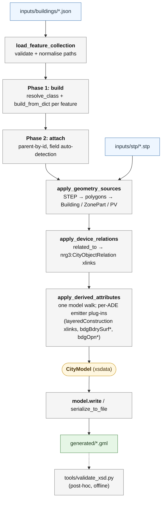

# CityGML 2.0 + Energy ADE 3.0 Creator

[](https://github.com/DaanSchlosser/CityGML2.0-EnergyADE3.0_creator/actions/workflows/ci.yml)
[](LICENSE)
[](pyproject.toml)

A Python toolkit for generating CityGML 2.0 files extended with Energy
ADE 3.0 (beta8), CityGML's extension mechanism for energy data. The
point is an easier authoring path: you describe the model in JSON and
attach STEP or CityJSON geometry, and the toolkit assembles and
serialises the Energy ADE GML so you never write the XML by hand.

> **Viewing the output in KITModelViewer?** The viewer ships with an
> incompatible Energy ADE 2.0 schema. See
> [§6 KITModelViewer compatibility](#6-kitmodelviewer-compatibility) for
> the one-time XSD swap.

---

## 1. Research context

This toolkit contributes to
**[RenoDAT](https://3d.bk.tudelft.nl/projects/renodat/)**
(*Accelerating building **RENO**vation and decarbonization through
**DAT**a integration*), a TU Delft-led,
[NWO](https://www.nwo.nl/en/projects/xqbeg97133)-funded project
(2025 to 2029) building the data infrastructure for Building Renovation
Passports. It tests whether CityGML 2.0 + Energy ADE 3.0 (beta8,
developed well before RenoDAT) is a workable starting point for those
passports, through two pipelines that exercise the question on
different inputs.

| Pipeline | Input | Purpose in RenoDAT |
|---|---|---|
| **Per-building** | Hand-authored feature-collection JSON + Rhino STEP geometry | Can the standard carry the full detail of a single renovation passport (zones, schedules, devices, layered constructions, material libraries) for one dwelling? The [owner-occupier reference building](inputs/buildings/owner_occupier_building.json) (a single-family residence in Delft, LoD0-LoD3 with thermal zone parts) is the worked example. |
| **City-scale** | JSON config naming a Dutch municipality | Does the same data model scale to the dwelling stock? Fetches BAG + 3DBAG + EP-Online (+ optional solar panels, BGT/BOR tree register, CFTree vegetation) for an entire area and assembles one GML file. |

Both pipelines emit the same wire format, so a consumer reads one
schema no matter which pipeline produced the file. The output renders
in KITModelViewer after the §6 XSD swap and carries real-world
coordinates in EPSG:28992 (RD) + EPSG:5109 (NAP).

---

## 2. Quick start

The toolchain is pinned for reproducibility: the Python version is fixed
in [.python-version](.python-version) (3.12) and the full dependency graph
is locked in [uv.lock](uv.lock), so [uv](https://docs.astral.sh/uv/)
recreates the exact environment this toolkit was developed and tested
against. CI runs the same steps on every push.

```powershell
# one-time setup with uv (fetches Python 3.12 if needed, installs from uv.lock)
uv sync --all-extras

# per-building: generate the GML file for the reference building
uv run python examples/create_building.py

# validate the output offline against the bundled XSDs
uv run python tools/validate_xsd.py generated/owner_occupier_building.gml

# run the test suite
uv run pytest -q
```

<details>
<summary>Prefer a plain venv + pip (Python 3.12+)?</summary>

```powershell
python -m venv .venv
.\.venv\Scripts\Activate.ps1
python -m pip install --upgrade pip
python -m pip install -e ".[dev]"            # add ,city,city-fast for the city pipeline

python examples/create_building.py
python tools/validate_xsd.py generated/owner_occupier_building.gml
python -m pytest -q
```

</details>

Custom paths are supported via `--input` / `--output`. The city-scale
pipeline needs the `city` extras and an EP-Online API key in `.env` if
energy labels are requested (see §4); `uv sync --all-extras` already
includes them. The optional `city-fast` extra adds `polars` for faster
EP-Online CSV filtering. All extras are declared in
[pyproject.toml](pyproject.toml).

---

## 3. Per-building pipeline

Everything the generator needs lives in a single JSON document
([inputs/buildings/owner_occupier_building.json](inputs/buildings/owner_occupier_building.json))
with these top-level keys:

```jsonc
{
  "city_model":          { "name": "...", "description": "..." },
  "coordinate_origin":   [85182.085, 446868.675, 0.105],
  "construction_mapping": {
    "by_type": { "WallSurface": "constr_external_wall", "Window": "constr_window_hr" },
    "by_id":   { "id_building_1_Door2_1": "constr_front_door" }
  },
  "geometry_sources": [
    { "type": "step-building-lod3",
      "path": "Owner-Occupier1_LOD3_STEP.stp",
      "target_building_id": "id_building_1",
      "target_pv_id": "pv_panel_1" }
  ],
  "features": [
    { "type": "bldg:Building", "id": "id_building_1", "name": ["..."], ... },
    { "type": "nrg3:PhotovoltaicCollector", "parent": "id_building_1", "id": "pv_panel_1", ... }
  ]
}
```

- **`features`** is a flat list. Each entry has a `type`
  (`prefix:ElementName`, resolved against the xsdata bindings), an `id`
  (XML NCName), and an optional `parent` (parent's gml:id). Children
  attach to the field on the parent whose type matches; if more than
  one field qualifies, `parent_field` disambiguates.
- **`geometry_sources`** lists STEP files to import.
  `step-building-lod{0..4}` drives building geometry (LoD2/LoD3 emit
  per-face thematic surfaces and openings, and accept an optional
  `target_pv_id`); `step-zonepart-lod{0..3}` does the same for
  ZoneParts. STEP layer names (`WallSurface_04`, `RoofSurface_02`,
  `Window_05`, `Door_01`, `SolarPanelSurface_*`) drive classification;
  openings are matched to their parent surface by interior-ring
  geometry, not by name.
- **`construction_mapping`** routes surfaces to constructions in the
  in-document `LayeredConstructionLibrary`. `by_type` maps a class to a
  construction id; `by_id` maps a specific surface gml:id to a
  construction id and wins on conflict.
- **`coordinate_origin`** is added to every imported STEP coordinate,
  placing local Rhino models on RD/NAP. **`srs_name`** and
  **`srs_dimension`** override the default
  `urn:ogc:def:crs,crs:EPSG::28992,crs:EPSG::5109` / `3`.

A JSON schema for editor autocomplete lives at
[schemas/citygml_energy_input.schema.json](schemas/citygml_energy_input.schema.json).
See [docs/mapping_building.md](docs/mapping_building.md) for field-to-XSD
mapping notes and [inputs/buildings/README.md](inputs/buildings/README.md)
for the shareable sanitised sample fixture.

### 3.1 Pipeline



Every stage runs offline. No schema downloads, no XML templates.

### 3.2 Design notes

- **xsdata as the binding layer.** All xsdata classes are auto-generated
  from the official XSDs. Regenerating `citygml_energy/bindings.py`
  (~84k lines) after an XSD change requires no code changes elsewhere:
  downstream code resolves classes through
  `mapping.resolve_class("prefix:LocalName")` at call time, and `NSMAP`
  is built at import time from the bindings plus
  [schemas/namespace_prefixes.json](schemas/namespace_prefixes.json).
  To add an ADE, drop its XSD in, append the path to `_STAGED_ROOTS`
  in `tools/generate_bindings.py`, and rerun.
- **Flat-dict input, parent-by-id.** Children reference parents by
  `gml:id` rather than nesting. The validator rejects unknown types,
  duplicate or non-NCName ids, parent cycles, Energy ADE containment
  violations, dangling `construction_mapping` references, and
  mistyped or missing geometry-source targets.
- **STEP geometry separate from data.** The JSON contains no vertex
  coordinates. Geometry comes from Rhino `.stp` files, offset by
  `coordinate_origin` on import. Ordinate output is quantised to a µm
  grid (6 fractional digits, fixed-point), so reruns are byte-stable.
- **Plug-in seam for ADE properties.** `derived_attributes.py` owns
  one model walk; each ADE plug-in module exports `EMITTERS` (and
  optional `SETUPS`). The current Energy ADE 3.0 plug-ins are
  `construction_mapping.py` (layeredConstruction xlinks) and
  `boundary_attributes.py` (`bdgBdrySurf*` / `bdgOpn*` area,
  inclination, azimuth, thickness, heat capacity).
- **Ships its own schemas.** The repository ships every XSD it needs,
  so validation, binding regeneration, and tests run without network
  access.

---

## 4. City-scale pipeline

A separate pipeline in
[`citygml_energy/city_builder/`](citygml_energy/city_builder/) produces
a CityGML + Energy ADE file for an entire Dutch municipality by
combining:

- **BAG** (PDOK WFS): authoritative `bag:pand` outlines and
  `bag:verblijfsobject` units with embedded address fields.
- **3DBAG** ([data.3dbag.nl](https://data.3dbag.nl)): per-Pand
  LoD0/LoD1/LoD2 CityJSON tiles.
- **EP-Online** ([public.ep-online.nl](https://public.ep-online.nl)):
  the Dutch energy-label register, joined by `BAGVerblijfsobjectID`
  when present, falling back to a normalised address key.
- **Solar panels** *(optional)*: 2D roof-panel polygons from a GeoPackage,
  projected onto LoD2 roof surfaces as
  `nrg3:GenericSolarCollector` (technology-agnostic, because the aerial
  source has no module-level metadata).
- **Trees** *(optional)*: per-tree LoD3 crown + trunk meshes from
  [CFTree](https://github.com/NoahAlting/CFTree), optionally enriched
  with **BGT** (authoritative-register cross-reference) and **Emmen BOR**
  (species + planting year). Full rationale in
  [docs/vegetation_integration_report.md](docs/vegetation_integration_report.md).
- **CBS Postcode6** *(optional)*: per-PC6 dwelling-energy aggregates
  emitted as `nrg3:UrbanFunctionArea` features, with
  `grp:groupMember` xlinks to the buildings inside each polygon.

### 4.1 Quick start

```powershell
python -m pip install -e ".[city]"
python examples/create_city.py --input inputs/cities/emmer-compascuum_small-area.json
```

The default config (~41.5 ha Emmer-Compascuum AOI) doubles as the
canonical smoke test.

**EP-Online API key.** Set `EP_ONLINE_API_KEY` in `.env` at the project
root (git-ignored). Without it, set `include_energy_labels: false`.
The first run fills `cache_dir` with BAG/3DBAG/EP-Online responses;
subsequent runs read from cache instead of refetching.

### 4.2 Config

```jsonc
{
  "$schema": "../../schemas/city_input.schema.json",
  "municipality": "Delft",                    // required
  "bbox": [84000, 445000, 86000, 447000],     // optional clip, EPSG:28992
  "lods": [0, 1, 2],
  "include_addresses": true,
  "include_energy_labels": true,
  "cache_dir": "../../.cache/citygml_energy_city",
  "output": "../../generated/delft.gml",      // required
  "srs_name": "urn:ogc:def:crs,crs:EPSG::28992,crs:EPSG::5109",
  "srs_dimension": 3,
  "city_model": { "name": "Delft", "description": "..." }
}
```

Optional `solar_panels`, `vegetation`, and `cbs_postcode6` blocks enable
the corresponding inputs. The full schema lives at
[schemas/city_input.schema.json](schemas/city_input.schema.json),
generated from `CityBuildConfig` by
[tools/generate_city_input_schema.py](tools/generate_city_input_schema.py)
and drift-checked by `tests/test_city_input_schema.py`. Example
configs live in [inputs/cities/](inputs/cities/).

### 4.3 Output shape per Pand

- `bldg:Building` (`gml:id = "pand_<identificatie>"`) with
  `yearOfConstruction` from 3DBAG.
- `lod0FootPrint`, `lod1Solid`, and per-planar-polygon LoD2
  `bldg:boundedBy` surfaces (`GroundSurface` / `WallSurface` /
  `RoofSurface`), each carrying a single-polygon `lod2MultiSurface` and
  the three Energy ADE 3.0 per-surface descriptors derivable from
  geometry alone (`bdgBdrySurfTotalSurfaceArea`,
  `bdgBdrySurfInclination`, `bdgBdrySurfAzimuth`). LoD set filtered by
  the `lods` config.
- One `core:Address` per VBO at Building level (xAL street + house
  number + postcode + woonplaats + suffixes), with each
  `nrg3:BuildingUnit` xlink-referencing its own address.
- One `nrg3:BuildingUnit` per VBO (`gml:id = "bu_<vbo_identificatie>"`)
  with `nrg3:energyPerformanceCertificate` (when EP-Online matched) and
  up to four regime-aware `nrg3:Energy` resources (NTA 8800 vs legacy
  NEN-7120). The regime table lives in
  [city_builder/energy_resources.py](citygml_energy/city_builder/energy_resources.py).
- When `solar_panels` is configured: one `nrg3:GenericSolarCollector` per
  panel intersecting a LoD2 roof, with an `installedOn` xlink onto
  that roof surface.
- When `vegetation` is configured: one `veg:SolitaryVegetationObject`
  per CFTree mesh with LoD3 geometry and CFTree / BGT / BOR
  morphometrics.
- When `include_energy_labels` is enabled: a single
  `app:Appearance` colouring every building's surfaces by the averaged
  EPC label of its BuildingUnits (EU energy-label palette; buildings
  with no match render grey). Separate themes are emitted for PV
  panels and vegetation when configured.

### 4.4 Performance and further reading

Per-Pand build can be parallelised via `CITYGML_ENERGY_ASSEMBLY_WORKERS`
(default `1`; pickle/spawn cost only pays off past a few thousand
panden). Module layout is in [§5](#5-repository-layout); the full
data-source-to-XSD mapping and design rationale live in
[docs/mapping_city.md](docs/mapping_city.md).

---

## 5. Repository layout

```
citygml_energy/                Core package
├── bindings.py                 xsdata-generated dataclasses (Energy ADE 3.0 + CityGML 2.0)
├── mapping.py                  Generic dict → xsdata, parent linking, tree traversal
├── input_loader.py             JSON loader, validator, two-phase orchestrator
├── geometry.py                 STEP → xsdata attachment, auto-discovered taxonomy
├── _step.py                    ISO 10303-21 parser (xsdata-independent)
├── gml_builders.py             Pure GML primitive builders (µm-quantised output)
├── device_relations.py         related_to → nrg3:CityObjectRelation resolver (RELATION_KINDS registry)
├── derived_attributes.py       Plug-in seam for ADE-property emitters
├── construction_mapping.py     Energy ADE 3.0 plug-in: layeredConstruction xlinks
├── boundary_attributes.py      Energy ADE 3.0 plug-in: bdgBdrySurf* / bdgOpn*
├── core.py                     CityModel wrapper
├── serialization.py            XmlSerializer wrapper (NSMAP + tab indent)
├── namespaces.py               NSMAP from bindings + namespace_prefixes.json
├── schema_types.py             "prefix:LocalName" constants used in Python
├── generation.py               generate_city_model / generate_gml_file
├── errors.py                   CityGMLError → InputFileError / CityBuildError
├── _xsdata_patches.py          Runtime patches for xsdata edge cases
└── city_builder/               City-scale pipeline
    ├── pipeline.py             Orchestrator: build_city_model(config)
    ├── pand_executor.py        Per-Pand build executor (sequential or pool)
    ├── config.py, http.py, boundary.py, pdok_wfs.py     Config, cached HTTP, AOI loader, WFS paginator
    ├── cityjson_parse.py, cityjson_trees_parse.py       CityJSON tile parsers
    ├── address_key.py, address_match.py                 VBO ↔ EP-online address join
    ├── epc_score.py, energy_resources.py, appearance.py EPC palette, regime-aware Energy, app:Appearance
    ├── solar_panels.py, vegetation.py, tree_matching.py    Optional input loaders + nearest-neighbour join
    ├── postcode6.py            CBS Postcode6 → nrg3:UrbanFunctionArea
    ├── _helpers.py             Shared helpers (type coercion, cache keys, gml:id sanitisation)
    ├── builders/               Per-feature builders (building, address, epc, vegetation)
    └── fetchers/               One module per remote source (BAG, 3DBAG, EP-online, BGT, Emmen BOR, CBS, PDOK)

examples/
├── create_building.py          Per-building CLI + library entry point
└── create_city.py              City-scale CLI + library entry point (default INFO; -v drops to DEBUG)

tools/
├── generate_bindings.py            Regenerate bindings.py from XSD
├── generate_input_schema.py        Regenerate per-building JSON schema
├── generate_city_input_schema.py   Regenerate city-scale JSON schema
├── generate_pv_simulation.py       Compute NTA 8800 monthly PV-yield series
├── validate_xsd.py                 Offline XSD validation
├── create_anonymised_sample.py     Produce the shareable sanitised sample input
├── merge_cftree_tiles.py           Merge CFTree CityJSON tile exports
├── audit_extra.py                  Audit generated GML: non-positive quantities, out-of-range angles, ADE hooks
├── audit_silent_bugs.py            Audit for silent data-loss bugs
└── bench.py                        Benchmarking utilities

inputs/                         See inputs/README.md
├── buildings/                  Per-building feature-collection JSONs
├── stp/                        STEP geometry for the per-building JSONs
├── cities/                     City-scale configs
├── boundaries/                 GeoJSON AOI polygons
├── vegetation/                 CFTree LoD 3 tree meshes (CityJSON)
└── solar_panels/                Solar panel GeoPackage (UoG Zenodo 14860030, CC-BY-4.0)

schemas/
├── citygml_energy_input.schema.json   Generated per-building JSON schema
├── city_input.schema.json             Generated city-scale JSON schema
└── namespace_prefixes.json            Hand-maintained URI → prefix map

xsd/                            CityGML 2.0 + GML 3.1.1 + xLink + xAL (offline copies)
Energy_ADE-3.0beta8/            Energy ADE 3.0 beta8 XSD + Alderaan reference (Apache-2.0; see PROVENANCE.md)

tests/                          Per-building, city-scale, and infra tests
docs/
├── adr/                        Architecture decision records (0001-0003)
├── mapping_building.md         Per-building BAG / EP-online field-to-XSD mapping notes
├── mapping_city.md             City-scale data-source mapping + design notes
├── kitmodelviewer.md           One-time Energy ADE 3.0 schema swap for the KIT viewer
├── threedbag_sliver_walls.md   3DBAG near-zero-area wall handling
└── vegetation_integration_report.md   CFTree + BGT + BOR analysis

generated/                      Pipeline output (git-ignored)

.github/workflows/ci.yml        CI: ruff + ruff format + mypy + pytest (uv-based)
CITATION.cff                    Citation metadata (CFF 1.2.0)
LICENSE                         MIT licence for the toolkit
pyproject.toml                  Metadata, dependencies, ruff / mypy / pytest config
uv.lock                         Locked dependency graph
.python-version                 Pinned interpreter (3.12)
```

> The KITModelViewer install directory
> (`KITModelViewer_V7.5.2_Build-3777/`) may sit next to this repo for
> the §6 fix but is git-ignored and not part of the project.

---

## 6. KITModelViewer compatibility

The [KITModelViewer](https://www.iai.kit.edu/english/1266_4808.php) (KIT
IAI's CityGML and IFC viewer, successor to the FZKViewer) is a separate,
free download from KIT and is **not** bundled in this repository. Get it
from the KIT IAI page above, then apply the one-time schema swap below.

The viewer ships with an Energy ADE **2.0** schema, so GML files using
Energy ADE **3.0** will not display correctly until you swap in the 3.0
schema. The generated GML is XSD-valid either way; the swap only touches
your own viewer install, not this repo. The one-time procedure (plus the
symptoms it fixes) is in
[docs/kitmodelviewer.md](docs/kitmodelviewer.md).

---

## 7. Tests

Run with `python -m pytest -q`. The [tests/](tests/) tree groups by
concern:

- **End-to-end.**
  [test_reference_building.py](tests/test_reference_building.py) (per-building)
  and [test_city_pipeline.py](tests/test_city_pipeline.py) (city-scale)
  both build a full model and assert XSD validity plus completeness
  (every input feature id appears as a `gml:id` in the output; XSD
  validation alone cannot detect silently-dropped features, since most
  Energy ADE children are `minOccurs=0`).
- **Pipeline invariants.**
  [test_pipeline_invariants.py](tests/test_pipeline_invariants.py)
  asserts completeness, byte-for-byte determinism, coordinate
  formatting, and XML / Unicode round-trips across both pipelines.
- **Negative tests.**
  [test_invalid_inputs_rejected.py](tests/test_invalid_inputs_rejected.py)
  applies targeted corruptions (missing fields, parent cycles,
  containment violations, dangling construction-mapping references,
  mistyped geometry-source targets, and so on) to each owner-occupier
  fixture and asserts the loader raises `InputFileError` with a
  field-specific message.
- **Schema drift.** `test_input_schema.py`, `test_city_input_schema.py`,
  and `test_generate_bindings_staging.py` keep the generated JSON
  schemas and the bindings build pipeline in sync.
- **Unit tests.** Auto-discovery contracts (`test_namespaces_discovery`,
  `test_mapping*`, `test_geometry_discovery`), low-level parsers
  (`test_step`, `test_gml_builders`, `test_factory`,
  `test_multisource_metadata`, `test_epc_score`), and one
  `test_city_*` module per city-scale fetcher and stage.

---

## 8. Supported feature types

The owner-occupier reference input exercises the following types,
round-tripped through the loader:

- `bldg:Building`, `nrg3:BuildingUnit`, `core:Address`
- `nrg3:EnergyPerformanceCertificate`
- `nrg3:PhotovoltaicCollector`, `nrg3:HeatPump`,
  `nrg3:EVChargingStation`, `nrg3:ThermalDistribution`,
  `nrg3:ThermalStorageDevice`, `nrg3:GenericElectricalDevice`
- `nrg3:Occupants`, `nrg3:Energy`
- `nrg3:Zone`, `nrg3:ZonePart`
- `nrg3:ConstantValueSchedule`, `nrg3:MonthlyTimeSeries`
- `nrg3:MaterialLibrary`, `nrg3:LayeredConstructionLibrary`

Any other class defined in `bindings.py` can be added to the input
without code changes; the loader resolves it dynamically by
`prefix:ElementName`.

---

## 9. Reproducibility and environment

- **Pinned toolchain.** [.python-version](.python-version) fixes Python 3.12
  and [uv.lock](uv.lock) locks every transitive dependency, so `uv sync`
  rebuilds the tested environment exactly.
- **Continuous integration.**
  [.github/workflows/ci.yml](.github/workflows/ci.yml) runs `ruff check`,
  `ruff format --check`, `mypy`, and the full `pytest` suite on every push
  and pull request.
- **Offline validation.** `tools/validate_xsd.py` validates output against
  the CityGML 2.0 + GML 3.1.1 schemas in [xsd/](xsd/) and the Energy ADE 3.0
  beta8 schema in [Energy_ADE-3.0beta8/](Energy_ADE-3.0beta8/), with no
  network access.
- **Sample data.** The owner-occupier reference building ships as a sanitised
  JSON + STEP fixture (see
  [inputs/buildings/README.md](inputs/buildings/README.md)).

---

## 10. Licence and citation

This toolkit is released under the **MIT License** (see [LICENSE](LICENSE)).

Bundled third-party components keep their own licences:

- [Energy_ADE-3.0beta8/](Energy_ADE-3.0beta8/) is the CityGML Energy ADE 3.0
  (beta 8) schema set by Dr. Giorgio Agugiaro (TU Delft), redistributed
  unmodified under the **Apache License 2.0** (see
  [Energy_ADE-3.0beta8/LICENSE](Energy_ADE-3.0beta8/LICENSE) and
  [Energy_ADE-3.0beta8/PROVENANCE.md](Energy_ADE-3.0beta8/PROVENANCE.md)).
- The two tracked files under `KITModelViewer_V7.5.2_Build-3777/` are the
  Energy ADE 3.0 upgrade for the KIT viewer (see §6); the viewer itself is a
  separate KIT download and is not part of this repository.

To cite the software, use the metadata in [CITATION.cff](CITATION.cff) (GitHub
renders a "Cite this repository" button from it). A persistent DOI will be
added once a tagged release is archived.
